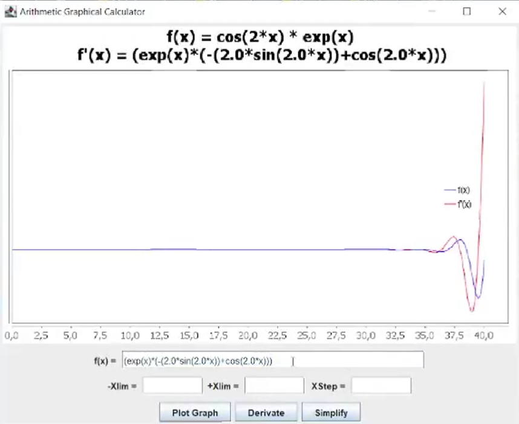

# Graphical Function Calculator

## Overview
The **Graphical Function Calculator** is a powerful and user-friendly application built in **Scala**. It enables users to perform advanced mathematical operations such as **derivation**, **integration**, and **function graphing**. The core of this calculator is an expression parser implemented in the `Arithm` package, which simplifies handling complex mathematical expressions.

## Features
- **Graphical Representation**: Visualize mathematical functions on a graph.
- **Expression Parsing**: Parse and evaluate mathematical expressions with ease.
- **Differentiation**: Compute the derivative of a given function.
- **Integration**: Perform numerical integration for a given function.

## Usage
1. Enter a mathematical function to evaluate or plot.
2. Use the options to differentiate or integrate the function.
3. View the graphical representation of the function or the results of the operations.

## Example Commands
- To plot a function: `f(x) = x^2 + 3x - 5`
- To differentiate: `f'(x)`
- To integrate: `\int f(x) dx`

## Authors
Sixtine Brisard & Ewen BERNARD

